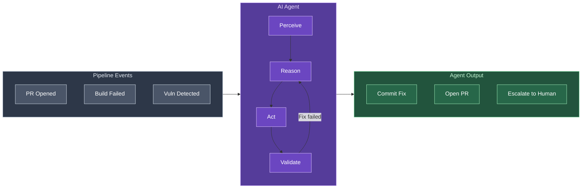

  <h3 style="color: #666; margin-bottom: 1rem;"><i class="fas fa-robot"></i> The Agentic CI/CD Stack</h3>
  

    

      

        
      

       <small><strong>GitHub Copilot</strong></small>
    

    

      

        
      

       <small><strong>GitLab Duo</strong></small>
    

    

      

        
      

       <small><strong>Amazon Q</strong></small>
    

    

      

        
      

       <small><strong>CircleCI</strong></small>
    

  

Every CI/CD pipeline I've worked with has the same failure mode: a build breaks, someone context-switches into it, reads logs for ten minutes, finds the issue, pushes a fix, waits for CI to pass again. Multiply that by a few times a week across a team and you're burning serious hours on toil that follows the same pattern every time.

Agentic AI changes that equation. Not "AI-assisted" in the sense of a chatbot you paste logs into — agentic, meaning it perceives the failure, reasons about the cause, takes multi-step action to fix it, validates the fix, and commits the result. No human in the loop until review time.

This isn't theoretical. Elastic ran an agentic CI system on their monorepo and in the first month it fixed 24 broken PRs, made 22 commits, and saved an estimated 20 days of developer time. Airwallex used AI subagents to cut integration testing from two weeks to two hours. These are production systems, running today.

Let me walk through what's actually out there, how it works architecturally, and where the real risks are.

---

## What Makes It "Agentic"

The word gets overused, so let me be specific. Traditional ML in CI/CD does one thing: it classifies or predicts. "This test is 87% likely to be flaky." "This vulnerability is severity high." Useful, but it's a single inference step — a human still has to act on it.

An agentic system does this:

1. **Perceive** — detect a build failure, new PR, security alert, or drift event
2. **Reason** — read logs, correlate errors, identify root cause
3. **Plan** — decide on a fix strategy, break it into steps
4. **Act** — edit code, run commands, invoke tools
5. **Validate** — run tests, check the fix didn't break something else
6. **Iterate** — if validation fails, try a different approach
7. **Report** — commit the fix, open a PR, or escalate to a human

The key difference is autonomy over a multi-step workflow. The agent isn't waiting for you to copy-paste the error message — it's already reading the logs, already generating a patch, already running the test suite against it.

| | Traditional ML in CI/CD | Agentic AI in CI/CD |
|---|---|---|
| **Execution** | Single inference step | Multi-step workflow with tool use |
| **Adaptability** | Fixed config, can't handle novel failures | Adapts strategy when initial approach fails |
| **Scope** | Predict, classify, score | Detect → diagnose → fix → validate → commit |
| **Error handling** | Fails and stops | Retries, reformulates, or escalates |
| **Human role** | Human acts on predictions | Human reviews agent's completed work |

---

## The Tools That Actually Exist

This isn't a future-state roadmap. These are shipping products.

### GitHub Copilot Coding Agent

GitHub's agent can be assigned an issue, spin up an ephemeral dev environment via GitHub Actions, explore the codebase, make changes, run tests and linters, push commits to a draft PR, and request human review. It also does agentic code review powered by CodeQL — identifying issues and applying fixes directly in PRs.

The newer **AgentHQ** (announced at GitHub Universe 2025) adds a control plane for orchestrating multiple AI agents integrated with Actions workflows.

### Amazon Q Developer

AWS's `/review` agent performs SAST scanning, secrets scanning, and code quality review. It can generate entire CI/CD configurations (CodePipeline, CDK, Terraform) from a natural-language prompt and identifies security misconfigurations in IaC — open S3 buckets, overly permissive IAM policies, the usual suspects.

### Harness AIDA

Harness has a multi-agent platform: DevOps Agent, AppSec Agent, SRE Agent, Release Agent, and Test Agent that delegate tasks to each other. You can describe a pipeline in plain English — "Create a pipeline with a CI stage to build my app, an STO stage to scan for vulnerabilities, and a CD stage to deploy to production" — and it generates the config. Their security agent is trained on all public CVEs and CWEs, claiming 50-75% reduction in remediation time.

### GitLab Duo Agent Platform

GA'd in January 2026. Includes a Security Analyst agent for triaging and remediating vulnerabilities through chat, root cause analysis that scans CI/CD logs and recent code changes, and AI-powered SAST false-positive detection. The Agent Platform provides a catalog for discovering and sharing agents across your organization.

### CircleCI "Chunk"

An autonomous agent that continuously analyzes pipelines for flaky tests, failed builds, and configuration drift. It proposes fixes via natural-language conversation and validates changes in your environment before applying them. Their MCP server integration exposes the full CI/CD toolkit (build debugging, test analysis, config management, deployment controls) through conversational AI.

### Snyk Agent Fix

Autonomously generates and validates security fixes in PRs. Verifies that fixes won't break code or introduce new vulnerabilities. Their MCP integration enables agents to auto-detect, analyze, and fix vulnerabilities, then create PRs without manual intervention.

### The Smaller Players Worth Knowing

- **CodeRabbit** — AI code review across 2M+ repos, 13M+ PRs reviewed. Runs 35+ linters agenically per PR using GPT-4.5 and Claude Opus 4.
- **Nx Cloud** — Self-healing CI that auto-commits fixes when the AI is confident the fix is verified.
- **Gitar** — Detects linting errors and test failures, creates fixes, commits to PR branches. Claims 17+ hours saved weekly.
- **Dagger** — Framework for self-healing pipelines with AI agents (from the creators of Docker).
- **FOSSA fossabot** — Context-aware dependency updates that analyze impact on your specific codebase and adapt code for breaking changes.
- **Mabl** — Self-healing test execution with 85% reduction in test maintenance.

---

## Architecture: How Agents Plug Into Pipelines

There are several patterns emerging for how agentic AI integrates with CI/CD. Here's what I see in practice.

### Event-Driven Agents

The most common pattern. An event (PR opened, build failed, vulnerability detected) triggers the agent via webhook. The agent runs as a step in your existing pipeline or as a sidecar process.

### Human-in-the-Loop Gates

The agent runs autonomously up to a checkpoint, then pauses for human approval before taking high-impact actions (deploying, merging, modifying infrastructure). State persists at the checkpoint so the agent doesn't replay previous work.

This is what GitHub Copilot does — it creates a draft PR and waits. CI workflows don't execute until a human approves.

### Maker-Checker Loops

A generator agent creates output (a code fix, a config change), then a separate critic agent evaluates it against criteria (security guidelines, test coverage, style rules). The maker revises until the checker approves or an iteration cap is hit.

CodeRabbit does this internally — the AI generates review feedback, then validates its own suggestions against 35+ static analysis tools in sandboxed environments before posting.

### Multi-Agent Orchestration

Specialized agents handle different domains and delegate to each other. Harness runs this with their DevOps, AppSec, SRE, Test, and Release agents sharing context through a knowledge graph that maps relationships among people, pipelines, services, incidents, and infrastructure.

### MCP (Model Context Protocol) Integration

A standardized protocol for agents to discover and invoke tools. CircleCI's MCP server exposes their CI/CD toolkit so any AI dev tool can interact with pipelines through natural language. GitHub's MCP support enables agents to call tools across the ecosystem without custom integrations.

---

## What It Looks Like in Production

### Elastic: Self-Healing CI for a Monorepo

Elastic integrated an AI agent into their monorepo CI pipeline, initially targeting PRs from the Renovate dependency management bot. When a dependency bump broke a build, the agent would:

1. Identify the failing test and specific error
2. Fix the problem
3. Commit to the working branch
4. Iterate until the fix passed or give up

**Results in the first month** (limited to 45% of dependencies): 24 broken PRs fixed, 22 commits by the AI, an estimated 20 days of developer time saved.

Their key learning: tuning the agent's behavior through repository-level configuration files was critical. The agent initially followed undesired coding practices until they taught it the team's conventions. Their principle: "Never commit AI work without human supervision."

### Airwallex: Integration Test Generation

Used AI subagents to generate integration tests. Cut testing time from two weeks to two hours. The agents understood the codebase well enough to generate meaningful test scenarios, not just boilerplate.

### Self-Healing Rollouts with Argo

Carlos Sanchez published a detailed implementation: an AI agent analyzes logs from stable vs. canary deployments during Argo Rollouts, responds with a promote/rollback recommendation and confidence level. On failure, it auto-creates a GitHub Issue with an LLM-generated description and assigns a coding agent to work on the fix.

### Industry Numbers

| Metric | Result |
|---|---|
| Harness vulnerability remediation time | 50-75% reduction |
| Mabl test maintenance burden | 85% reduction |
| VirtuosoQA deployment time | 78% reduction |
| GitLab Duo adoption | 1.5M developers, 30% faster releases |
| CodeRabbit scale | 2M+ repos, 13M+ PRs reviewed |

---

## The Real Risks

This section matters more than the features. Giving an AI agent write access to your CI/CD pipeline is a fundamentally different risk profile than using a chatbot.

### Hallucination in Automated Systems

When an LLM hallucinates in a chat window, someone reads it and moves on. When an agent hallucinates a code fix that happens to pass tests, you've got a subtle bug in production. Elastic explicitly called this out: "Undeterminism in generative AI means that you can never blindly trust the changes proposed by this automation. Reviews are imperative."

Worse, in multi-agent systems, a hallucinated fact can compound — one agent's fabricated output becomes another agent's input. Research found that a single compromised agent poisoned 87% of downstream decision-making within 4 hours in simulated multi-agent environments.

### Security: OWASP's Top 10 for Agentic Applications

OWASP published their Top 10 for Agentic Applications in late 2025. The highlights:

- **Agent Goal Hijack** — hidden prompts turned copilots into exfiltration vectors
- **Tool Misuse** — agents bent legitimate tools into destructive outputs
- **Identity & Privilege Abuse** — agents bypassed CI/CD security checks with elevated access
- **Supply Chain Vulnerabilities** — MCP ecosystems poisoned at runtime
- **Memory Poisoning** — poisoned memory reshaping agent behavior long after initial interaction

The **"PromptPwnd"** vulnerability class showed how untrusted content in GitHub issues, PRs, and commit messages can be injected into prompts inside CI/CD workflows — a practical attack vector when combined with over-privileged agents.

### Cost

AI agents aren't cheap at scale:

- Average $1K-$5K/month in token costs alone
- Programming prompts run 3-4x the token length of general prompts
- High variance — some runs use 10x more tokens than others for the same task
- Enterprise rollouts run $50K-$200K over 3-6 months including integration work

Gartner predicts 40%+ of agentic AI projects will be canceled by end of 2027 due to escalating costs, unclear ROI, or inadequate risk controls. Start small.

### Compliance and Audit Trails

Non-deterministic LLM behavior makes traditional audit approaches insufficient. Standard CI/CD logs miss critical data: the prompts, tool inputs/outputs, intermediate reasoning steps, and decision paths the agent followed. If you're in a regulated industry, you need to solve this before deploying agents with write access.

---

## Mitigation: How to Deploy This Safely

OWASP's principle of **Least Agency** is the right starting point: only grant agents the minimum autonomy needed for bounded tasks.

**Start with read-only agents.** Let the AI analyze logs, review PRs, and generate reports before you give it commit access. This builds trust and surfaces edge cases without risk.

**Use human-in-the-loop gates for high-impact actions.** The agent can create a draft PR, but a human merges. The agent can recommend a rollback, but a human approves. GitHub Copilot's model — draft PRs that require human approval before CI runs — is the right default.

**Sandbox everything.** Run agent actions in ephemeral environments. CodeRabbit runs its 35+ tool validations in sandboxed "tools in jail" environments. Do the same.

**Scope permissions tightly.** Per-agent permissions with short-lived credentials and just-in-time elevation. An agent that reviews code doesn't need deploy access.

**Log the full reasoning chain.** Capture prompts, tool calls, intermediate outputs, and decision paths — not just the final commit. You'll need this for debugging and compliance.

**Feature-flag the rollout.** Start with low-risk outputs (comments, draft PRs, reports) in a small subset of repos. Expand scope as you build confidence. Pin prompt versions and compare new behavior against baselines.

---

## What's Production-Ready vs. Experimental

| Capability | Status | Examples |
|---|---|---|
| AI code review on PRs | **Production** | CodeRabbit, GitHub Copilot, Amazon Q |
| Security scanning + auto-fix | **Production** | Snyk Agent Fix, Harness AIDA, GitLab Duo |
| NL pipeline generation | **Production** | Harness, Amazon Q Developer |
| Infrastructure drift detection | **Production** | Firefly, env0, Infra.new |
| Self-healing CI (dependency bumps) | **Early production** | Elastic + Claude, Nx Cloud |
| Intelligent test selection | **Early production** | CircleCI, VirtuosoQA |
| Multi-agent pipeline orchestration | **Experimental** | Harness multi-agent, GitLab Agent Platform |
| Fully autonomous deployments | **Experimental** | Only in bounded domains with canary analysis |
| Enterprise-wide agent constellations | **Research** | Multi-agent systems managing full SDLC |

Only 14% of organizations have agentic AI solutions ready to deploy in production (Deloitte, 2025). Most are still piloting. The technology works in bounded domains — auto-fixing dependency bumps, reviewing PRs, scanning for vulnerabilities. Fully autonomous pipelines remain experimental.

---

## Getting Started

If you want to try this in your own pipelines, here's a practical progression:

1. **Week 1: Read-only agent** — Set up CodeRabbit or GitHub Copilot code review on a non-critical repo. Let it comment on PRs. Read its suggestions. Understand what it catches and what it misses.

2. **Week 2-3: Security scanning** — Add Snyk or GitLab Duo security scanning to your CI pipeline. Let the agent flag vulnerabilities and suggest fixes, but don't auto-apply.

3. **Month 2: Self-healing CI** — On a repo with good test coverage, let an agent auto-fix failing linter checks or dependency bumps. Require human review on all PRs it creates. Start with Nx Cloud's self-healing CI or wire up your own with Claude Code and your CI system.

4. **Month 3+: Expand scope** — Based on what you've learned, gradually increase the agent's autonomy. Add test generation, pipeline optimization, drift detection.

The pattern is always the same: read-only first, then write access with human gates, then increased autonomy as you build trust. Skip steps and you'll end up in Gartner's 40% cancellation statistic.

---

## Where This Is Going

The gap between "demo" and "production" is closing fast. A year ago, most of this was conference-talk material. Today, Elastic is running self-healing CI on their monorepo, CodeRabbit has reviewed 13 million PRs, and Harness is orchestrating multi-agent DevOps workflows.

The next year will be about reliability engineering — making these systems predictable, auditable, and safe enough for regulated environments. The tools are there. The architectures are proven. The remaining work is operational maturity: logging, monitoring, governance, and building organizational trust.

The CI/CD pipeline has always been the natural integration point for automation. Agentic AI is the next layer — not replacing the pipeline, but making it self-aware.

---

*Questions? Find me on [GitHub](https://github.com/gpayne9) or [LinkedIn](https://linkedin.com/in/guy-p-devops).*
