<div align="center" style="margin: 2rem 0;">
  <h3 style="color: #666; margin-bottom: 1rem;"><i class="fas fa-tools"></i> Tech Stack</h3>
  <div style="display: flex; justify-content: center; align-items: center; gap: 2rem; flex-wrap: wrap;">
    <div style="text-align: center;">
      <div style="background: #f0f0f0; border-radius: 16px; padding: 12px; display: inline-block;">
        
      </div>
      <br><small><strong>Ollama</strong></small>
    </div>
    <div style="text-align: center;">
      <div style="background: #f0f0f0; border-radius: 16px; padding: 12px; display: inline-block;">
        
      </div>
      <br><small><strong>Open WebUI</strong></small>
    </div>
    <div style="text-align: center;">
      <div style="background: #f0f0f0; border-radius: 16px; padding: 12px; display: inline-block;">
        
      </div>
      <br><small><strong>Mac mini M4</strong></small>
    </div>
    <div style="text-align: center;">
      <div style="background: #f0f0f0; border-radius: 16px; padding: 12px; display: inline-block;">
        
      </div>
      <br><small><strong>Tailscale</strong></small>
    </div>
  </div>
</div>

I run a local ChatGPT-like setup from my apartment. No API keys, no monthly fees, no data leaving my network. The LLM runs on a Mac mini M4 using Ollama, and the chat interface is Open WebUI running on a Raspberry Pi. Tailscale connects everything so I can use it from anywhere — my laptop at a coffee shop, my phone on the train, whatever.

The interesting part of this setup is the split: the Pi handles the web UI (lightweight, always on, costs nothing to run), and the Mac mini handles the actual inference (Metal GPU acceleration, fast enough for real conversations). They talk to each other over Tailscale, so it works whether I'm sitting next to them or on the other side of the world.

## What You Need

**Required:**
- Mac mini M4 (or any Apple Silicon Mac) — this is your inference engine
- Tailscale account (free tier is fine)

**Optional but recommended:**
- Raspberry Pi 4 — offloads the web UI so the Mac mini just does inference
- Any other device you want to access it from

You can skip the Pi entirely and run everything on the Mac mini. But separating the UI from the compute makes the setup more flexible — the Pi stays on 24/7 drawing 5W, the Mac mini can restart or swap models without killing your chat session, and you get a dedicated always-available endpoint.

---

## Architecture

```mermaid
flowchart TD
    subgraph clients["👤 Your Devices"]
        laptop["💻 Laptop"]
        phone["📱 Phone"]
    end

    subgraph tailscale["🔒 Tailscale Mesh Network"]
        ts["Encrypted WireGuard Tunnel"]
    end

    subgraph pi["🍓 Raspberry Pi 4"]
        webui["Open WebUI<br/>Chat Interface<br/>Port 3000"]
    end

    subgraph mac["🖥️ Mac mini M4"]
        ollama["Ollama Server<br/>Port 11434"]
        gpu["Apple Metal GPU<br/>Unified Memory"]
        models["Local Models<br/>Qwen 14B · Llama 8B<br/>CodeLlama · Mistral"]
        ollama --> gpu --> models
    end

    laptop & phone -->|HTTPS| ts
    ts -->|Private Network| webui
    webui -->|"Ollama API<br/>via Tailscale"| ollama

    style clients fill:#2d3748,stroke:#a0aec0,color:#e2e8f0
    style tailscale fill:#1a365d,stroke:#63b3ed,color:#bee3f8
    style pi fill:#22543d,stroke:#68d391,color:#c6f6d5
    style mac fill:#553c9a,stroke:#b794f4,color:#e9d8fd
    style ts fill:#2b6cb0,stroke:#90cdf4,color:#fff
    style webui fill:#276749,stroke:#9ae6b4,color:#fff
    style ollama fill:#6b46c1,stroke:#d6bcfa,color:#fff
    style gpu fill:#6b46c1,stroke:#d6bcfa,color:#fff
    style models fill:#6b46c1,stroke:#d6bcfa,color:#fff
    style laptop fill:#4a5568,stroke:#cbd5e0,color:#fff
    style phone fill:#4a5568,stroke:#cbd5e0,color:#fff
```



The request flow: you open the chat UI in a browser → Open WebUI sends the prompt to Ollama's API → Ollama runs inference on the Mac mini's GPU → streams the response back. All traffic is encrypted through Tailscale.

---

## Step 1: Ollama on the Mac Mini

[Ollama](https://ollama.com) makes running LLMs on a Mac dead simple. Install it and pull a model:

```bash
brew install ollama
ollama pull qwen2.5:14b-instruct-q4_K_M
```

That downloads a 9GB quantized 14B parameter model. On the M4, it runs at 30-60 tokens/sec — fast enough that responses feel instant for most conversations. If you want something snappier, an 8B model like Llama 3 hits 60-100 tokens/sec.

### Enable Remote Access

By default, Ollama only listens on localhost. Since Open WebUI needs to reach it from the Pi (or any other device on your tailnet), you need to tell Ollama to listen on all interfaces.

The catch: setting `OLLAMA_HOST` in `.zshrc` doesn't work because Ollama runs as a background service via launchd, not from your shell. You need to update the LaunchAgent:

```bash
launchctl setenv OLLAMA_HOST "0.0.0.0:11434"
```

Then restart Ollama. Verify it's listening:

```bash
curl http://localhost:11434/api/tags
```

This is safe because Tailscale handles access control — Ollama is only reachable from devices on your tailnet, not the public internet.

### Models Worth Trying

| Model | Size | Speed (M4) | Good For |
|---|---|---|---|
| `qwen2.5:14b-instruct-q4_K_M` | 9GB | 30-60 tok/s | General use, coding, writing |
| `llama3:8b` | 4.7GB | 60-100 tok/s | Fast responses, lighter tasks |
| `codellama:13b` | 7.4GB | 35-50 tok/s | Code generation and review |
| `mistral:7b` | 4.1GB | 70-100 tok/s | Quick and capable |

The Mac mini's 16GB unified memory limits you to roughly 14B parameter models at Q4 quantization. Anything bigger starts swapping and performance tanks.

---

## Step 2: Open WebUI

[Open WebUI](https://github.com/open-webui/open-webui) gives you a ChatGPT-style interface for Ollama. It supports conversation history, multiple models, system prompts, and file uploads. It's the part that makes the setup actually usable day-to-day rather than just hitting an API endpoint.

### Option A: On the Raspberry Pi (Recommended)

Run it on the Pi so you have a dedicated, always-on chat endpoint. The Pi does almost no real work here — it just serves the web UI and proxies requests to Ollama on the Mac mini.

```yaml
services:
  open-webui:
    image: ghcr.io/open-webui/open-webui:v0.5.8
    container_name: open-webui
    ports:
      - "3000:8080"
    environment:
      OLLAMA_BASE_URL: "http://<mac-mini-tailscale-ip>:11434"
    volumes:
      - open-webui_data:/app/backend/data
    restart: unless-stopped

volumes:
  open-webui_data:
```

Replace `<mac-mini-tailscale-ip>` with your Mac mini's Tailscale IP (find it with `tailscale ip` on the Mac).

**Important: pin the version to v0.5.8.** Newer versions of Open WebUI have PyTorch dependencies that fail to build on ARM64. The container will crash on startup with no useful error message. I learned this the hard way — v0.5.8 is the last version that runs cleanly on a Pi.

```bash
docker compose up -d
```

Open WebUI is now at `http://<pi-tailscale-ip>:3000`. The first user to register becomes admin.

### Option B: On the Mac Mini

If you don't have a Pi, just run everything on the Mac mini:

```yaml
services:
  open-webui:
    image: ghcr.io/open-webui/open-webui:latest
    container_name: open-webui
    ports:
      - "3000:8080"
    environment:
      OLLAMA_BASE_URL: "http://host.docker.internal:11434"
    volumes:
      - open-webui_data:/app/backend/data
    restart: unless-stopped

volumes:
  open-webui_data:
```

On the Mac mini you can use `:latest` since there's no ARM64 PyTorch issue on Apple Silicon with Docker Desktop. `host.docker.internal` lets the container reach Ollama running on the host.

---

## Step 3: Tailscale

[Tailscale](https://tailscale.com) is what makes this whole thing accessible from anywhere without exposing anything to the internet. Install it on every device — Mac mini, Pi, laptop, phone — and they're all on the same private network.

```bash
# Mac mini
brew install tailscale

# Raspberry Pi
curl -fsSL https://tailscale.com/install.sh | sh
sudo tailscale up
```

Once everything is connected, you can reach the Open WebUI from any device on your tailnet by browsing to the Pi's (or Mac mini's) Tailscale IP on port 3000.

### Optional: Set Tailscale DNS

If you're also running Pi-hole on the Pi (which I'd recommend — it's free ad blocking for every device), you can set the Pi as your tailnet's DNS server in the Tailscale admin console. Every device that joins gets ad-blocking DNS automatically.

---

## Why Split the UI and the Compute?

You might wonder why not just run everything on the Mac mini. You can, and it works. But splitting them gives you some nice properties:

**The Pi is always on.** It draws 5W and runs 24/7. The Mac mini can sleep, restart, or be doing something else. Your chat history and web UI are always available.

**Independent updates.** You can swap Ollama models, update Ollama itself, or restart the Mac mini without touching the UI. And you can update Open WebUI without affecting inference.

**The Pi is a better endpoint.** It has a stable Tailscale IP, it's always reachable, and it doesn't care about macOS updates or Docker Desktop quirks. It just runs containers.

**It costs nothing extra.** If you already have a Pi sitting around (and most of us do), putting Open WebUI on it is free compute. The Pi's job is trivial — serve a web app and proxy API calls.

---

## What It Looks Like in Practice

Once it's set up, the daily workflow is simple:

1. Open a browser on any device
2. Go to `http://<tailscale-ip>:3000`
3. Pick a model, start chatting

It feels like ChatGPT — conversation threads, model switching, code highlighting, markdown rendering. But it's running on your own hardware, your data stays local, and there are no usage limits.

I use it for code review, writing drafts, brainstorming, and quick lookups. The 14B Qwen model handles most tasks well. When I need something more capable, I'll pull a different model or fall back to a cloud API.

---

## Performance

| Model | Hardware | Tokens/sec | Notes |
|---|---|---|---|
| Qwen 2.5 14B (Q4) | Mac mini M4 | 30-60 | My daily driver |
| Llama 3 8B | Mac mini M4 | 60-100 | Faster, slightly less capable |
| Qwen 2.5 14B (Q4) | RTX 4080 | 80-120 | If you have a GPU box |

The M4 hits a good sweet spot. It's fast enough for interactive use, silent, and draws about 10W at idle. Compared to running an RTX 4080 (350W+ under load), it's a no-brainer for an always-on setup.

---

## Troubleshooting

**Open WebUI shows "Ollama is not reachable":**

Check that Ollama is listening on all interfaces:

```bash
curl http://<mac-mini-tailscale-ip>:11434/api/tags
```

If that times out, `OLLAMA_HOST` isn't set correctly. Make sure you're setting it via `launchctl setenv`, not just in your shell profile.

**Open WebUI crashes on Pi at startup:**

Almost certainly a version issue. Pin to `v0.5.8`:

```yaml
image: ghcr.io/open-webui/open-webui:v0.5.8
```

**Slow responses:**

Check which model is loaded (`ollama list`). If you pulled a model that's too large for 16GB, Ollama will swap to disk and performance drops off a cliff. Stick to 14B or smaller at Q4 quantization.

**Can't reach anything remotely:**

Make sure Tailscale is running on both ends. `tailscale status` shows connected devices and their IPs.

---

## Cost

| Item | Monthly |
|---|---|
| Mac mini M4 power (~10W idle) | ~$0.90 |
| Raspberry Pi power (~5W) | ~$0.45 |
| Tailscale | Free |
| Ollama | Free |
| Open WebUI | Free |
| **Total** | **~$1.35/month** |

Compare that to ChatGPT Plus at $20/month or API costs that scale with usage. The hardware pays for itself quickly if you're a regular user.

---

## Getting Started

1. Install Ollama on your Mac: `brew install ollama`
2. Pull a model: `ollama pull qwen2.5:14b-instruct-q4_K_M`
3. Enable remote access: `launchctl setenv OLLAMA_HOST "0.0.0.0:11434"`
4. Install Tailscale on the Mac and Pi
5. Deploy Open WebUI on the Pi (or the Mac), pointed at the Mac's Tailscale IP
6. Open a browser, start chatting

---

*Questions? Find me on [GitHub](https://github.com/gpayne9) or [LinkedIn](https://linkedin.com/in/guy-p-devops).*
