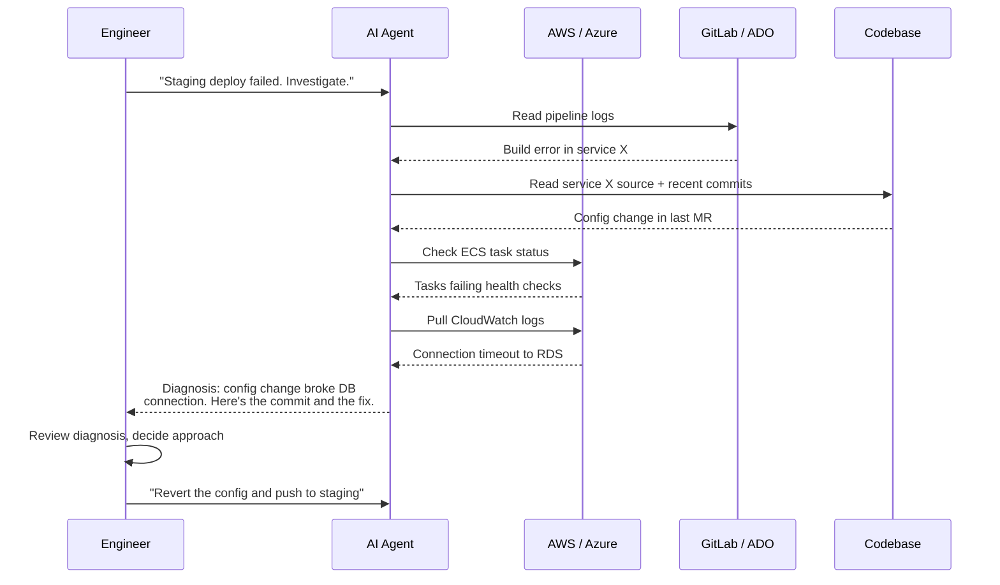

<div align="center" style="margin: 2rem 0;">
  <h3 style="color: #666; margin-bottom: 1rem;"><i class="fas fa-terminal"></i> The Agentic DevOps Toolkit</h3>
  <div style="display: flex; justify-content: center; align-items: center; gap: 2rem; flex-wrap: wrap;">
    <div style="text-align: center;">
      <div style="background: #f0f0f0; border-radius: 16px; padding: 12px; display: inline-block;">
        
      </div>
      <br><small><strong>Claude Code</strong></small>
    </div>
    <div style="text-align: center;">
      <div style="background: #f0f0f0; border-radius: 16px; padding: 12px; display: inline-block;">
        
      </div>
      <br><small><strong>OpenAI Codex</strong></small>
    </div>
  </div>
</div>

Most comparisons of Claude Code and Codex focus on coding benchmarks. How fast can it write a React component? How many SWE-bench tasks does it solve? That's fine if you're a software developer. But if you're a DevOps engineer, you're using these tools differently — and the things that matter are completely different too.

My day-to-day looks like this: something breaks in staging. I point an AI agent at the GitLab pipeline, have it read the failed job logs, then check the ECS service in AWS, then read the Terraform that provisioned it, then cross-reference with the last merge request. The agent gathers context across four or five systems. I read what it found. I decide what to do. I tell it to execute.

I call this the **scout workflow** — the agent investigates, I command. After months of running both Claude Code and Codex this way across AWS, Azure, GitLab, and Azure DevOps, the differences are real and worth documenting. But they're not always where you'd expect.

---

## The Full Surface Area

Both tools have grown well beyond a single CLI. To compare them fairly, you need to look at the complete picture: CLI, desktop app, VS Code extension, and how they work together.

| Surface | Claude Code | Codex |
|---------|-------------|-------|
| **CLI** | Terminal REPL, persistent bash session | Rust-based TUI (Ratatui), `codex exec` for headless |
| **Desktop App** | Code tab inside the Claude Desktop app | Standalone native macOS/Windows app |
| **VS Code Extension** | Sidebar panel with inline diffs, `@-mention` file references | Sidebar panel, same app-server as desktop |
| **Web** | claude.ai/code for remote sessions | chatgpt.com/codex (cloud sandbox, no internet) |
| **Config Format** | `CLAUDE.md` + `~/.claude/settings.json` | `AGENTS.md` + `~/.codex/config.toml` |
| **Plugin System** | Skills (`.claude/skills/SKILL.md`) | Skills + Plugins (`@plugin` mentions) |
| **MCP Support** | Yes — `~/.claude.json` or `.mcp.json` | Yes — `~/.codex/config.toml` or `codex mcp` |

---

## Codex's Killer Feature: Thread Management

This is where Codex genuinely pulls ahead for multi-task DevOps work, and most comparisons miss it entirely.

Codex organizes everything around **threads** — persistent conversations tied to a git repo. The desktop app groups threads by project directory, so when you open it, you see all your repos on the left and all your conversation threads per repo underneath. You can have five threads open for the same infrastructure repo: one investigating a pipeline failure, one refactoring a Terraform module, one writing a new Helm chart, one reviewing a teammate's MR, and one running a long-lived monitoring task.

The magic is that **threads sync across surfaces**. Both the desktop app and the VS Code extension connect to the same `codex-app-server` — a Rust-based JSON-RPC server that handles all the agent logic. Start a thread in the desktop app, switch to VS Code to review the inline diffs, go back to the desktop app to monitor progress. The state follows you because both clients talk to the same backend process.

Each thread gets its own sandbox, so parallel agents don't interfere with each other. Codex has built-in git worktree awareness: when running multiple threads on the same repo, each agent operates in its own worktree to prevent lockfile churn and accidental branch switching. You can even fork a thread (`thread/fork`) to branch off a conversation and explore a different approach without losing your place.

**The practical upshot:** During a busy incident, you can fire off three investigation threads simultaneously — one checking the cloud environment, one parsing application logs, one reviewing recent code changes — and review all of them from the desktop app's unified dashboard.

### Claude Code's Approach

Claude Code handles multi-session work differently. The Desktop app (a "Code" tab inside the Claude Desktop app, not a standalone app) has a sidebar for sessions, and each new session automatically gets its own git worktree. That part works well. The CLI has `--worktree` to achieve the same thing.

But the thread management story is less cohesive:
- CLI and VS Code share session history — you can `claude --resume` to pick up a VS Code conversation in the terminal.
- Desktop maintains separate session history from the CLI/VS Code pair.
- The `/desktop` CLI command migrates a CLI session into the Desktop app, which is nice but one-directional.
- There's no unified dashboard showing all your active sessions across a repo the way Codex's desktop app does.

For a single focused investigation, this doesn't matter. But when you're juggling five things across the same infrastructure repo — which is most days in DevOps — Codex's thread-per-repo model with unified visibility is genuinely better organized.

---

## Sandbox and Access: Not the Differentiator You'd Think

A lot of comparison articles make a big deal about Codex blocking network access by default and Claude Code leaving it open. In theory, Codex's default sandbox blocks cloud CLI calls unless you configure it otherwise.

In practice? This is a non-issue.

If you're doing DevOps work, you enable full access on both tools on day one. The Codex desktop app runs commands against AWS, Azure, kubectl, and anything else in your environment without friction. Claude Code does the same. Both tools need access to your cloud environments to be useful — and both give it to you.

The real safety model isn't a network sandbox. It's this:

1. **Give the agent full CLI access** — it needs to call `aws`, `az`, `kubectl`, `terraform`, `glab`, whatever your workflow requires.
2. **Tell it explicitly not to make write/delete changes to cloud resources.** Put this in your `AGENTS.md` or `CLAUDE.md`. Be specific: "Do not run any commands that modify, create, or delete cloud resources. Read-only investigation only unless I explicitly tell you to make a change."
3. **Have it assume read-only IAM roles by default.** For AWS, set your default profile to a read-only role and only swap to a write-capable profile when you've decided to make a change. Same principle applies to Azure service principals and GCP service accounts — the agent operates under the least-privilege credential, and you explicitly tell it to switch profiles when it's time to act. This way even if the agent ignores your instructions, the credentials themselves enforce the boundary.
4. **Keep code changes in version control.** The agent can edit files all day — that's what `git diff` and `git checkout` are for. The blast radius of a bad file edit is zero if you review before committing.

This approach works identically in both tools. The sandbox configuration is a detail you set once and forget. What actually matters is the workflow you build on top of it.

---

## The Scout Workflow in Practice

Here's how the investigation pattern plays out with each tool:



Both tools handle this workflow well once you've given them full access and clear instructions about read-only behavior. The differences are in the experience around it:

**Claude Code strengths in this workflow:**
- Sub-agents run in parallel: it might check AWS and GitLab simultaneously
- 1M token context window (Max plans) holds the entire investigation without compaction
- Persistent bash session: environment variables, auth tokens, and directory state carry across commands
- Plan Mode lets you run the whole investigation read-only, with zero risk of modification

**Codex strengths in this workflow:**
- Faster response generation: GPT-5 outputs at ~150 tokens/sec, noticeably faster than Claude Opus
- Cheaper per investigation: GPT-5 input tokens cost ~$1.25/M vs Claude Opus at $5/M
- Thread-per-investigation model: spin up three parallel investigations, review all of them from the desktop dashboard
- Open-source (Apache-2.0): if the agent does something unexpected, you can trace exactly what happened

---

## Skills: Claude Code's Differentiator

Both tools support MCP servers for connecting to external systems, and the ecosystems are comparable — GitHub, GitLab, AWS, Slack, Jira, databases, monitoring tools. MCP is an open standard and both tools implement it. This is not a differentiator.

Where Claude Code pulls ahead is **Skills** — reusable, structured instruction packages stored as `SKILL.md` files. Think of them as expert personas that load on demand.

**How Skills work:**
- At startup, Claude scans all available skills and loads only their name and description into context (roughly 100 tokens each). Full instructions load only when invoked.
- Skills follow the [Agent Skills](https://agentskills.io) open standard — the same format works in Codex CLI, Cursor, Gemini CLI, and GitHub Copilot.
- Stored hierarchically: `~/.claude/skills/` (personal), `.claude/skills/` (project), enterprise managed settings.

**Why this matters for DevOps:**

A Terraform skill can enforce naming conventions, module structure, provider version constraints, and security baselines — without burning context tokens on every prompt. An SRE skill can define your organization's SLO calculation methodology, error budget policies, and incident response procedures. A cloud investigation skill can codify your team's debugging runbook: "check ECS first, then CloudWatch, then the recent deploy pipeline, then the Terraform state."

```
# .claude/skills/investigate-staging/SKILL.md
---
name: investigate-staging
description: Debug staging environment failures across ECS, CloudWatch, and GitLab
allowed-tools: ["Bash", "Read", "mcp__gitlab", "mcp__aws"]
---

When investigating staging failures:
1. Check the most recent GitLab pipeline for the affected service
2. Read the failed job logs, focusing on exit codes and error messages
3. Run `aws ecs describe-services` to check task health
4. Pull the last 100 CloudWatch log lines for failing tasks
5. Cross-reference the failure timeline with recent merge requests
6. Present findings as: root cause, affected systems, recommended fix
```

Claude Code also recently shipped Skills 2.0 with automatic evals and A/B testing — you can define test prompts and expected outputs to validate that a skill actually works before sharing it with your team.

Codex has its own skills system that loads from `$REPO_ROOT/.agents/skills/` and follows progressive disclosure (metadata first, full content on activation). It also supports `@plugin` mentions for quick invocations. The systems are converging — both use SKILL.md files based on the same open standard — but Claude Code's implementation is more mature and has a larger ecosystem as of March 2026.

---

## Multi-Surface Experience Compared

### Starting an Investigation

**Codex Desktop App:**
1. Open the app, select your infrastructure repo from the sidebar
2. Click "New Thread" — starts a sandboxed agent tied to that repo
3. Type your investigation prompt
4. While it runs, open another thread for a different task
5. Review all thread results in the desktop dashboard
6. Switch to VS Code to review diffs inline, then back to desktop for the overview

**Claude Code Desktop:**
1. Open Claude Desktop, switch to the Code tab
2. Click "+ New session" — automatically creates a git worktree
3. Type your investigation prompt
4. For parallel work, open another session (gets its own worktree)
5. Review diffs inline with comments, submit with Cmd+Enter
6. Use the embedded app preview and CI status bar for validation

**Claude Code CLI (my most common path):**
1. Open a terminal in the repo, run `claude`
2. Type the investigation prompt — it runs shell commands, reads APIs, gathers context
3. Review findings, approve actions
4. For parallel work: open another terminal, run `claude --worktree`
5. Resume any session later with `claude --resume`

### Config and Continuity

| | Claude Code | Codex |
|---|---|---|
| **Project instructions** | `CLAUDE.md` (layered: root, subdirs, `~/.claude/CLAUDE.md`) | `AGENTS.md` (layered: root, subdirs, `~/.codex/AGENTS.md`) |
| **MCP config** | `~/.claude.json` or `.mcp.json` per project | `~/.codex/config.toml` under `[mcp_servers]` |
| **Config shared across surfaces** | Yes — CLI, VS Code, and Desktop all read the same files | Yes — CLI, VS Code, and Desktop share `config.toml` |
| **Session continuity** | CLI ↔ VS Code share history. Desktop is separate. `/desktop` migrates CLI → Desktop | Desktop ↔ VS Code share threads via app-server. CLI shares config but has its own TUI sessions |
| **Resume sessions** | `claude --resume` (interactive picker) or `claude -c` (last session) | `thread/resume` API, desktop app shows all threads |

---

## Permission Models

Both tools layer approval controls on top of their sandbox architecture:

### Claude Code

| Mode | File Edits | Shell Commands |
|------|-----------|----------------|
| **Plan Mode** | Read-only | Read-only |
| **Normal** (default) | Approval required | Approval required |
| **Accept Edits** | Auto | Approval required |
| **Auto Mode** | Auto | Auto |

Plus `--allowedTools` for granular control: `--allowedTools "Read" "Bash(aws ecs describe-services)"` restricts to specific commands.

### Codex

| Mode | File Edits | Shell Commands |
|------|-----------|----------------|
| **Suggest** (default) | Approval required | Approval required |
| **Auto-Edit** | Auto | Approval required |
| **Full-Auto** | Auto | Auto |

The models are nearly identical. Both default to "ask before doing anything" and both have a full-auto mode for when you trust the agent. The real permission layer for DevOps isn't the tool's approval prompt — it's the instructions in your `CLAUDE.md` or `AGENTS.md` telling the agent what it's allowed to do in your cloud environment. "Read-only unless I say otherwise" is the most important permission you set, and it lives in your project config, not the tool's UI.

---

## Remote Access and GitHub Integration

This is where Claude Code has a significant lead that matters for DevOps — the ability to work across devices and manage sessions remotely.

### Claude Code: Work From Anywhere

**Remote Control** lets you start a Claude Code session on your workstation and connect to it from your phone, tablet, or any browser. Your machine keeps running the session; the remote device is just a window into it. No ports to open — it works over outbound HTTPS with automatic reconnection if your machine sleeps.

```bash
# Start a session with remote control enabled
claude --rc

# Or enable mid-session
/rc
```

A QR code appears in the terminal. Scan it with the Claude iOS or Android app, or open the URL in any browser. You're now controlling your local terminal session — with full access to your filesystem, cloud CLIs, and MCP servers — from your phone.

**Why this matters for DevOps:** You kick off an investigation on your workstation before leaving your desk. On the train, you check the results from your phone and tell it to apply the fix. You're not SSH-ing into a box from a phone keyboard — you're having a conversation with an agent that has access to everything.

**claude.ai/code** goes further. Connect your GitHub account, install the Claude GitHub app on your repos, and you can start full Claude Code sessions against any repo from a browser — no local machine needed. Claude clones your repo into an Anthropic-managed VM, edits code, runs tests, and pushes branches. You can create PRs directly from the web interface.

**Session handoff** is where it all ties together:

| Command | What It Does |
|---------|-------------|
| `claude --rc` | Enable remote control — connect from phone/browser |
| `claude --remote "task"` | Start a cloud session from your terminal |
| `/teleport` | Pull a web session into your local terminal |
| `/desktop` | Hand a CLI session to the Desktop app |
| "Continue in" menu | Move Desktop sessions to web or IDE |

**SSH sessions** in the Desktop app let you connect to remote machines — run Claude Code on a beefy cloud instance or a jump box while using the Desktop GUI on your laptop. Useful when your infrastructure is only accessible from specific networks.

### Codex: Cloud or Local, Not Both

**Codex Cloud** (chatgpt.com/codex) connects to GitHub repos via OAuth — clone, sandbox VM, execute, push. The core functionality is similar to claude.ai/code for kicking off tasks against a repo.

But the cross-device story stops there:

- **No remote control** — you can't connect to a running local Codex session from your phone
- **No session handoff** — no equivalent to `/teleport` or `--remote` for moving work between CLI and cloud
- **No mobile workflow** — no documented way to interact with running tasks from the iOS/Android app
- **Desktop and CLI are separate** — the Codex desktop app and CLI share config but don't bridge sessions across devices

Codex Cloud tasks are fire-and-forget: you start them from the web, check back later for results. That works for async code generation, but for the interactive investigation workflow where you're steering an agent through a live environment, you need the session to follow you.

### GitLab and Azure DevOps

Neither tool has a deep, native integration with GitLab or Azure DevOps. Both tools' web/cloud features are **GitHub-only**:

- **claude.ai/code** only works with GitHub-hosted repos
- **Codex Cloud** only connects to GitHub via OAuth

For GitLab and ADO, you're running the CLI locally (which works great — both tools call `glab` and `az devops` CLI just fine) or setting up CI pipeline jobs. Claude Code has a beta CI/CD pipeline integration co-maintained by GitLab, but it's not the same as the deep GitHub experience. Codex has no GitLab CI story at all.

If your primary git platform is GitLab or ADO, the remote/web features of both tools don't apply to you yet. The CLI and desktop app are your surfaces, and both work equally well there.

---

## Cost

| | Claude Opus 4.6 | Claude Sonnet 4.6 | GPT-5 (Codex) | codex-mini |
|---|---|---|---|---|
| **Input** | $5/M tokens | $3/M tokens | $1.25/M tokens | $1.50/M tokens |
| **Output** | $25/M tokens | $15/M tokens | $10/M tokens | $6/M tokens |
| **Typical investigation** | $2–8 | $0.50–3 | $0.25–2 | $0.15–1 |
| **Subscription** | Pro $20/mo, Max $100–200/mo | Same | Plus $20/mo, Pro $200/mo | Same |

Claude Code uses roughly 4x more tokens per task than Codex — it produces more thorough, documented output, but you pay for that thoroughness. For a quick "what's the status of this ECS service?" query, Codex is significantly cheaper. For a complex cross-system investigation where you want the agent to get it right the first time, the Claude premium is often worth it.

---

## Security

Giving an AI agent full access to your cloud environment sounds scary. In practice, it's manageable — the same way giving a junior engineer CLI access is manageable if you scope their IAM permissions and review their work.

**What actually works:**

1. **Explicit instructions in your project config.** Both `CLAUDE.md` and `AGENTS.md` are the first thing the agent reads. "Never run commands that create, modify, or delete cloud resources unless I explicitly ask you to" is your primary safety layer. Be specific: list the commands it should never run (`terraform apply`, `aws s3 rm`, `kubectl delete`).
2. **Read-only cloud credentials where possible.** Create IAM roles or service principals scoped to read-only for investigation sessions. Only switch to write-capable credentials when you're ready to remediate.
3. **Version control is your undo button.** Give the agent full write access to the repo — it's all tracked. If it makes a bad edit, `git checkout` is instant. The real risk is cloud state changes, not file changes.
4. **Audit third-party skills and MCP servers.** A Snyk report (Feb 2026) found 13% of public Claude Code skills had critical vulnerabilities. Community plugins are community code — review them before installing.
5. **Use approval mode for anything destructive.** Both tools default to asking before executing commands. Only switch to full-auto in environments you can afford to break.

---

## When to Use Which

| Scenario | Better Tool | Why |
|----------|-------------|-----|
| Investigating a production incident across cloud + CI/CD + code | **Claude Code** | Deep reasoning, 1M context window, Plan Mode for safe read-only |
| Running three parallel investigations on the same repo | **Codex** | Thread-per-repo model with desktop dashboard overview |
| Writing Terraform modules from a spec | **Either** | Both are strong at IaC generation |
| Reviewing inline diffs in VS Code | **Either** | Both have capable extensions |
| Managing investigations from your phone | **Claude Code** | Remote Control + mobile app, no Codex equivalent |
| Cost-sensitive high-volume scripting | **Codex** | 4x cheaper input tokens, 2.5x faster output |
| Codifying team debugging runbooks | **Claude Code** | Skills system is more mature, supports evals |
| Open-source requirement | **Codex** | Apache-2.0 licensed, fully inspectable Rust codebase |
| Azure DevOps workflows | **Either** | Neither has first-party ADO integration; both run `az devops` CLI |
| GitLab workflows | **Either** | Neither has deep GitLab integration; both run `glab` CLI fine |
| Working on GitHub repos from the web | **Either** | Both have cloud/web interfaces for GitHub repos |

---

## The Bottom Line

These tools are converging. Both have CLIs, desktop apps, VS Code extensions, MCP support, skills, and headless CI modes. The gap is narrowing with every release.

But today, the differences that matter for DevOps work are:

**Codex** has the better multi-task experience. The desktop app's thread-per-repo model with unified visibility, seamless sync between desktop and VS Code, and parallel agents make it genuinely easier to juggle five things at once — which is every day in DevOps.

**Claude Code** has the better deep investigation experience. The Skills system lets you codify team debugging runbooks. Plan Mode gives you risk-free read-only analysis. The 1M context window holds entire cross-system investigations. And the deeper reasoning model catches things that faster, cheaper models miss.

Both tools connect to your cloud environments equally well. Both run your CLIs, both support MCP, both have headless modes for CI/CD. The sandbox defaults are a one-time config detail, not a meaningful differentiator.

I use both. Codex when I need to move fast across multiple threads — fire off parallel tasks, review diffs, ship fixes. Claude Code when I need to go deep on a single problem — trace a failure across five systems, understand the full picture, make the right call.

The scout workflow doesn't care which brand is on the tool. It cares whether the agent can gather the right context and report back accurately. Both can. They just get there differently.

---

*Questions? Find me on [GitHub](https://github.com/gpayne9) or [LinkedIn](https://linkedin.com/in/guy-p-devops).*
