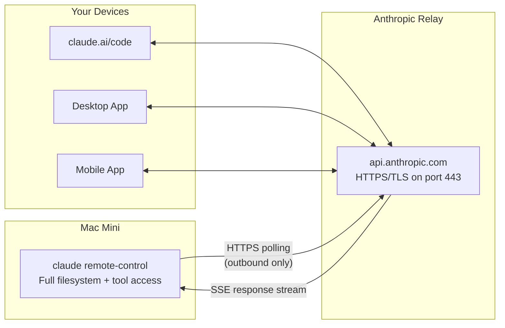

<div align="center" style="margin: 2rem 0;">
  <h3 style="color: #666; margin-bottom: 1rem;"><i class="fas fa-satellite-dish"></i> Tech Stack</h3>
  <div style="display: flex; justify-content: center; align-items: center; gap: 2rem; flex-wrap: wrap;">
    <div style="text-align: center;">
      <div style="background: #f0f0f0; border-radius: 16px; padding: 12px; display: inline-block;">
        
      </div>
      <br><small><strong>Mac Mini</strong></small>
    </div>
    <div style="text-align: center;">
      <div style="background: #f0f0f0; border-radius: 16px; padding: 12px; display: inline-block;">
        
      </div>
      <br><small><strong>Claude Code</strong></small>
    </div>
    <div style="text-align: center;">
      <div style="background: #f0f0f0; border-radius: 16px; padding: 12px; display: inline-block;">
        
      </div>
      <br><small><strong>Bash + tmux</strong></small>
    </div>
  </div>
</div>

<div align="center" style="margin: 0 0 2rem 0;">
  
</div>

Claude Code's remote control feature lets you connect to a running CLI session from claude.ai, the Claude desktop app, or the Claude mobile app. The session runs on your machine with full filesystem and tool access — the remote device is just a window into it.

The problem is that `claude remote-control` is a foreground process. Close your terminal, reboot, or lose network for ~10 minutes, and the session dies. I built [claude-always-on](https://github.com/gpayne9/claude-always-on) to solve this — persistent, self-healing remote control sessions that survive reboots and recover automatically.

This post covers how it works, why certain decisions were made, and what the broader community is doing with remote control setups.

---

## How Remote Control Actually Works

Remote control uses **HTTPS polling** through Anthropic's relay — not SSH, not WebSockets, not a tunnel. Your machine polls `api.anthropic.com` every few seconds for new messages and streams responses back via Server-Sent Events (SSE).



Key details:

- **Outbound only** — no ports are opened on your machine. Nothing is exposed to the internet.
- **Not a network tunnel** — only structured application messages pass through the relay, not raw TCP. This is fundamentally different from SSH, ngrok, or VS Code Remote Tunnels.
- **Same account auth** — the remote device must be signed into the same claude.ai account. No API keys.
- **~10 minute timeout** — if your machine loses network for that long, the session drops and must be restarted.
- **~320ms relay overhead** — negligible since LLM inference time dominates anyway.

---

## The Problem with Running It Raw

Running `claude remote-control` directly works fine when you're sitting at the machine. But for an always-on setup, you hit three problems:

1. **It's a foreground process.** Close the terminal, it dies. Reboot, it's gone.
2. **macOS aggressively sleeps headless Macs.** System sleep, disk sleep, and App Nap will all kill or throttle your sessions when the display is off.
3. **No built-in daemon mode.** There's an [open GitHub issue](https://github.com/anthropics/claude-code/issues/30447) requesting `--headless` support for systemd/Docker, but it's marked stale with no Anthropic response. The workaround is tmux.

---

## What claude-always-on Does

The [claude-always-on](https://github.com/gpayne9/claude-always-on) repo handles all of this with four scripts:

| Script | What It Does |
|--------|-------------|
| `start.sh` | Creates tmux sessions per repo, runs `claude remote-control` in a restart loop, starts caffeinate, disables App Nap |
| `monitor.sh` | Checks every 5 minutes that all sessions are alive with running claude processes. Restarts dead ones and sends macOS notifications. |
| `install.sh` | Generates and loads LaunchAgents so everything starts on login and monitoring runs automatically |
| `test.sh` | Diagnostic script that verifies pmset, App Nap, caffeinate, tmux sessions, and power assertions. Has a `--simulate` mode that forces display sleep and re-checks. |

### The Core Idea: Restart Loop

The key is a `while true` loop inside each tmux session:

```bash
while true; do
  claude remote-control --name "my-project" --spawn same-dir
  echo 'Claude exited, restarting in 10s...'
  sleep 10
done
```

If Claude exits for any reason — crash, auth timeout, network blip — it waits 10 seconds and restarts. The health monitor catches cases where the tmux session itself dies.

### Session Config

Repos are defined in a simple `sessions.conf` file:

```
my-project:$HOME/repos/my-project
my-api:$HOME/repos/my-api
my-site:$HOME/repos/my-site
```

Add a line, re-run `start.sh`, and the new session appears in your Remote Control dropdown.

### Quick Start

```bash
git clone https://github.com/gpayne9/claude-always-on.git
cd claude-always-on

# Edit sessions.conf with your repos
nano sessions.conf

# Configure power management
sudo pmset -a sleep 0 standby 0 tcpkeepalive 1 disksleep 0

# Start and verify
chmod +x *.sh
./start.sh
./test.sh

# Install auto-start + monitoring
./install.sh
```

Full setup instructions are in the [repo README](https://github.com/gpayne9/claude-always-on).

---

## Keeping a Headless Mac Awake

This was the most annoying part to figure out. macOS does three things that will kill your sessions on a headless Mac:

| Problem | Solution | How It's Handled |
|---------|----------|-----------------|
| **System sleep** | `caffeinate -s -d` running in a `keepawake` tmux session | `start.sh` creates this automatically |
| **App Nap** | Throttles background Node processes when display is off | `start.sh` sets `NSAppNapEnabled=false` globally |
| **Aggressive power settings** | Default pmset will sleep the machine, spin down disks, drop TCP connections | One-time `pmset` config (see below) |

The pmset settings you need:

```bash
sudo pmset -a sleep 0          # never sleep
sudo pmset -a standby 0        # no deep sleep
sudo pmset -a tcpkeepalive 1   # keep HTTPS connections alive
sudo pmset -a disksleep 0      # no disk sleep
```

The test script's `--simulate` mode validates this by temporarily setting `displaysleep 1`, waiting 90 seconds for the display to go dark, and then re-checking that all sessions survived.

---

## What the Community Is Doing

Remote control launched in February 2026 and the community has converged on a few patterns:

### VPS + tmux + Tailscale

The most popular alternative to a local Mac. People run Claude Code on $5–6/month VPS boxes (Hetzner, Vultr, DigitalOcean), connect via Tailscale for zero-config encrypted networking, and use Mosh for connection resilience on cellular. No Mac sleep issues to deal with.

### Docker Containers

Several projects containerize the whole stack:

- **[HolyClaude](https://github.com/CoderLuii/HolyClaude)** — Docker image with Claude Code + web UI + Playwright
- **[claude-remote-server](https://github.com/marmor69/claude-remote-server)** — Headless Docker for VPS deployment
- **[cli2agent](https://github.com/wjcjttl/cli2agent)** — Wraps Claude Code headless as HTTP/SSE endpoints

### Channels (March 2026)

Anthropic shipped [Channels](https://code.claude.com/docs/en/channels) — an MCP plugin that pushes events into a running session from Telegram, Discord, or iMessage. Claude responds through the same messaging app with full filesystem/git access. This is interesting for async workflows where you don't need the full claude.ai UI.

### Notification Hooks

A pattern from the community: use Claude Code hooks to send push notifications via [ntfy](https://ntfy.sh) or Pushover when Claude needs input. Hook into the `AskUserQuestion` event for high-priority alerts and `Stop` for task completion. Some setups only notify when connected remotely by checking the `SSH_CONNECTION` environment variable.

### The Connection Stability Reality

The biggest complaint across the community is **WebSocket disconnects** — sessions dropping every 20–60 minutes, auto-reconnection silently failing, sessions disappearing from the session list. The tmux restart loop approach is the standard workaround. It's not elegant, but it works.

---

## Security Considerations

Remote control is outbound-only HTTPS through Anthropic's relay. No ports are opened on your machine. That said, a few things to be aware of:

- **Session URL is a bearer token** — anyone with the URL (or who photographs the QR code) can operate the session. Keep your terminal private when the QR code is visible.
- **Sandbox is off by default** — remote sessions have full filesystem and tool access. Pass `--sandbox` to restrict this.
- **MCP servers are accessible** — any MCP servers configured in your Claude Code settings are available through remote sessions.
- **Authentication is account-level** — the only gate is being logged into the same claude.ai account.

In practice, the risk is low. The relay is TLS-encrypted, sessions require your Anthropic account credentials, and there's no inbound attack surface. But if you're running this on a shared machine or in an environment where someone could see your screen, it's worth keeping in mind.

---

## Resource Usage

Remote control servers are lightweight. Each one is a small Node process holding an HTTPS connection.

| Metric | Expected |
|--------|----------|
| **RAM** | ~50–100 MB total for 3 sessions |
| **CPU** | Negligible when idle |
| **Network** | Minimal polling traffic (~few KB every 2–5s per session) |

---

## The Real Payoff

Once this is running, you open the Claude app on your phone, tap a repo from the Remote Control dropdown, and start coding. Claude runs on your Mac Mini with full local access — your filesystem, your git repos, your MCP servers. The mobile app handles permission prompts the same way the terminal does.

I use this to review code, kick off tasks, and make changes from anywhere. The Mac Mini does the heavy lifting. My phone is just the remote.

The full setup, scripts, and detailed instructions are at [github.com/gpayne9/claude-always-on](https://github.com/gpayne9/claude-always-on).
